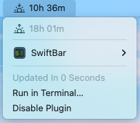

# Sunbar - a (swift|x|bit)bar sunset and sunrise display

## Requirements
Go
### external APIs
this script uses [ipgeolocation.io](https://ipgeolocation.io/) to get the sunrise and sunset dates for you approximate location based on your IP address. The api requires an API-key that can be acquired from the website for free. since the script queries the data only one per day you won't exceed the free plan ;).
### misc
to use the compiled version do `go build -o sunbar.1m.cgo` and move it to you plugin folder. alternatively move the go sourcecode file to the plugin directory.
